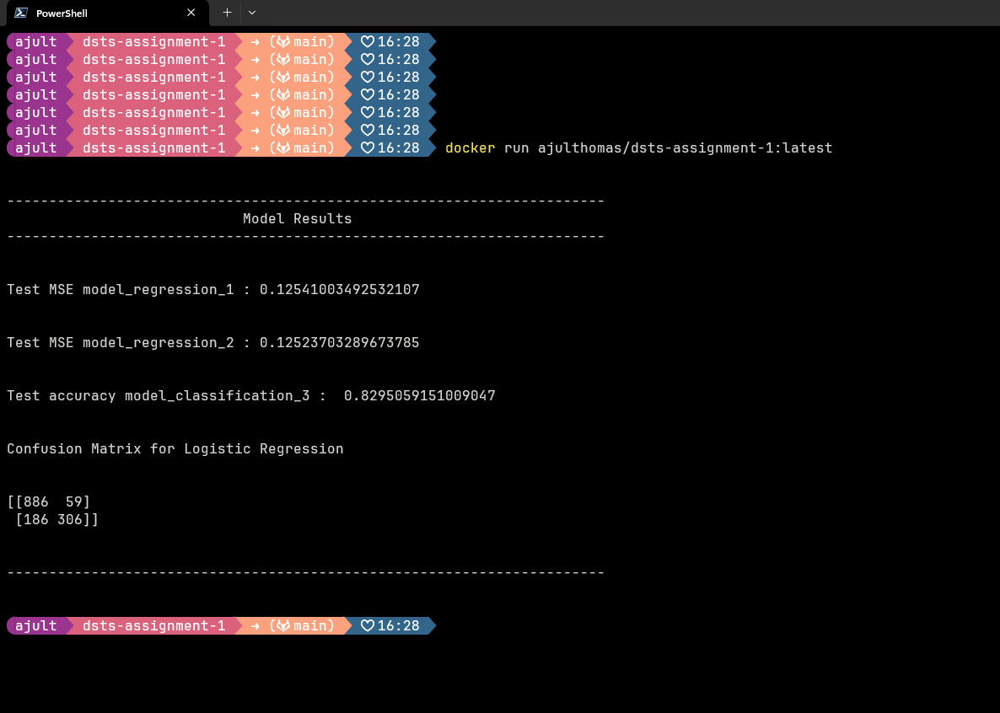

# DSTS-ASSIGNMENT-1

This repository contains code for data exploration, predictive modeling, and various machine learning tasks. The repository structure and its purpose are explained below.

## Repository Structure

- **data/**: Directory containing datasets used for training and testing the models.
- **images/**: Directory for saving visualizations and plots generated during data exploration and model evaluation.
- **data_exploration.ipynb**: Jupyter Notebook used for exploratory data analysis (EDA) on the datasets.
- **predictive_modelling.ipynb**: Jupyter Notebook for performing regression predictive modeling.
- **predictive_modelling_classification.ipynb**: Jupyter Notebook for detailed classification model building.
- **predictive_modelling_classification.py**: Python script that contains the code for running classification models.
- **predictive_modelling_regression.py**: Python script for running regression models.
- **main.py**: This is the main execution file that coordinates different parts of the project.
- **Dockerfile**: Docker configuration file to containerize the project.
- **git_workflow.md**: Documentation of the Git workflow followed for version control in this project.
- **README.md**: This file, explaining the repository structure and how to run the code.
- **Sydney Restaurants.twb**: Tableau workbook file for visualizing Sydney Restaurants data.
- **.gitignore**: Git configuration file specifying files and directories to ignore in version control.

## Requirements

Before running the code, ensure you have the following installed:

- Python 3.8 or above
- Jupyter Notebook
- Docker (optional, if you want to run it in a container)
- Libraries: Install the necessary libraries using:

```bash
pip install -r requirements.txt
```

## How to Run

1. **Data Exploration**:  
   Open the `data_exploration.ipynb` Jupyter Notebook to explore the dataset and visualize the data distribution and patterns. This is helpful to understand the features before applying machine learning models.

2. **Predictive Modeling**:

   - For regression and classification, you can either run the respective Jupyter Notebooks (`predictive_modelling.ipynb`, `predictive_modelling_classification.ipynb`) or execute the Python scripts:

   **To run classification model**:

   ```bash
   python predictive_modelling_classification.py
   ```

   **To run regression model**:

   ```bash
   python predictive_modelling_regression.py
   ```

3. **Main Execution**:
   If you'd like to run the entire pipeline, you can execute the `main.py` file:

   ```bash
   python main.py
   ```

4. **Using Docker**:
   You can containerize and run the entire project using Docker.
   Build the Docker image:

   ```bash
   docker build -t ajulthomas/dsts-assignment-1:latest .
   ```

   Run the container:

   ```bash
   docker run ajulthomas/dsts-assignment-1:latest
   ```

   

## Expected Output

- **Data Exploration**: You will see data visualizations and insights regarding the dataset, such as histograms, correlation matrices, and feature distributions.
- **Classification Models**: After running the classification script, the output will include model accuracy, confusion matrix, classification reports, and ROC curves.
- **Regression Models**: Running the regression script will produce metrics like RMSE, MAE, and R-squared, as well as visualizations like predicted vs actual plots.
- **Tableau Visualizations**: If using `Sydney Restaurants.twb`, you'll get interactive visualizations related to Sydney's restaurants' data.

## Git Workflow

Refer to `git_workflow.md` for instructions on how to follow the project's version control procedures using Git.
