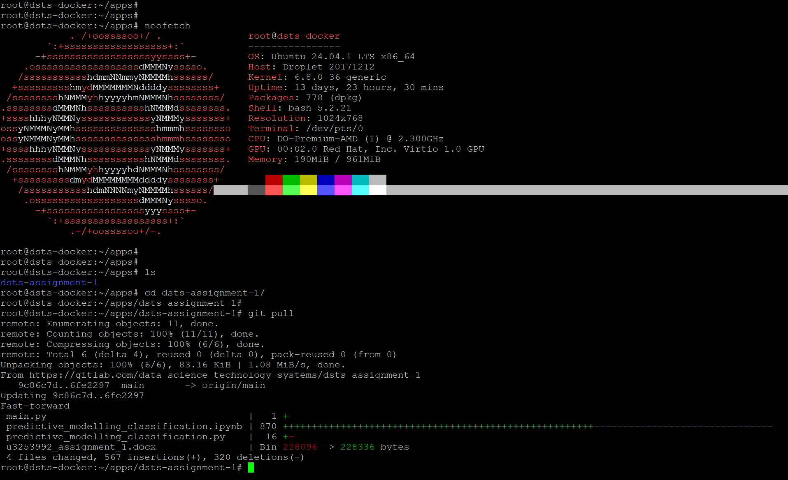
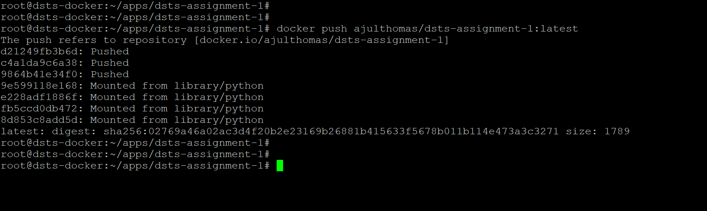

## Building a Docker Image

**Build the docker image**

```sh
docker build -t dsts-assignment-1:latest .
```

The above command asks docker engine to build a docker image with tag `dsts-assignment:1` as per the commands provided in the current directory donoted by `.`.

**Run the docker image**

```sh
docker run dsts-assignment-1:latest
```

The above command runs the docker image named `dsts-assignment-1:latest`.

## Uploading the docker image to Dockerhub

**Create a docker account**

I have created a docker account under the username `ajulthomas`

**Tagging my docker image in accordance with the dockerhub requirements**

```sh
docker tag dsts-assignment:1 ajulthomas/dsts-assignment-1:latest
```

**Pushing the image to dockerhub**

```sh
docker push ajulthomas/dsts-assignment-1:latest
```

**Dockerhub Repo Link**

[get the image from dockerhub here](https://hub.docker.com/r/ajulthomas/dsts-assignment-1)







