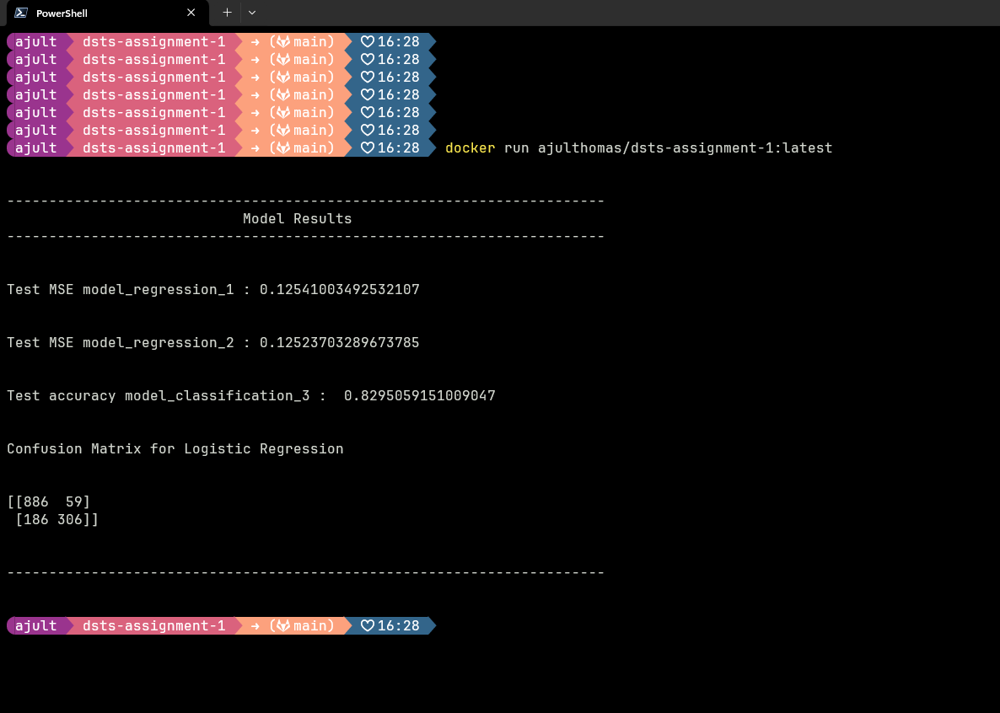

# Edge Computing

I have cloned thegitrepo and run the docker containers on Digital Ocean droplets, which are virtual compute solutions offered by digital ocean. I find them very useful to test out Data Science deployment pipeline.

I used `putty` to connect to the remote virtual machine via `ssh`.

