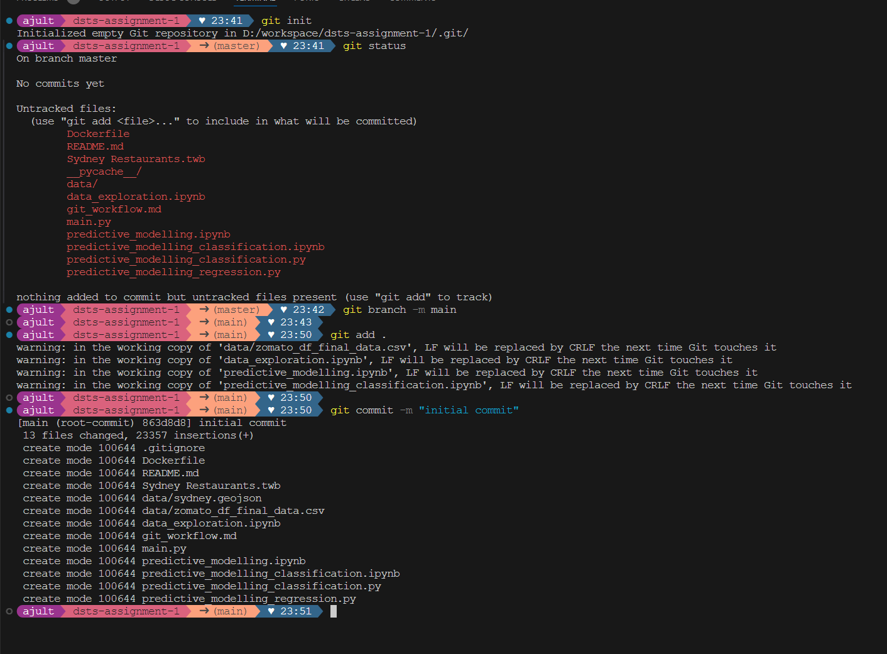
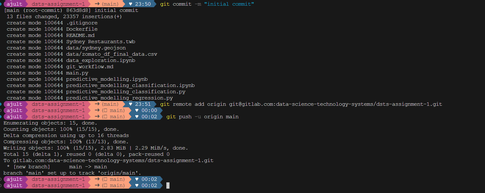

# Git Workflow

This document explains the commands used to set up `git version control` for this project.

## Setting up Local Repo

**Initialise the local Git repository**

```bash

# initialises the local repository
git init

# rename the default branch name to main
git branch -m main

```

**Add .gitignore file**

Add a `.gitignore` file mentioning the file names or extensions that doesn't needs to be tracked.

**Stage the files**

```sh
git add .
```

The `.` adds all files to the staging area of the local repository.

**Commiting the changes to local repository**

```sh
git commit -m "Initial commit"
```



## Setting up the remote or cloud repository

**Create online repository**

I have created an empty Gitlab respository named `dsts-assignment-1` (new repo for this assignment purpose [link here](https://gitlab.com/data-science-technology-systems/dsts-assignment-1.git)). This code is also uploaded to my github account under the repository `dsts-lab` (already existing repo).

**Connect the local repo to the remote repository**

```sh
git remote add origin git@gitlab.com:data-science-technology-systems/dsts-assignment-1.git
```

This command tells the local Git version control system that for the `dsts-assignment-1` local repo, the remote repository url is as provided and tells it to store the url in variable `origin`.

**Upload the local commits to remote repository**

```sh
git push -u origin main
```

This command pushes command from local `main` branch to remote(Gitlab repo) `main` branch.


